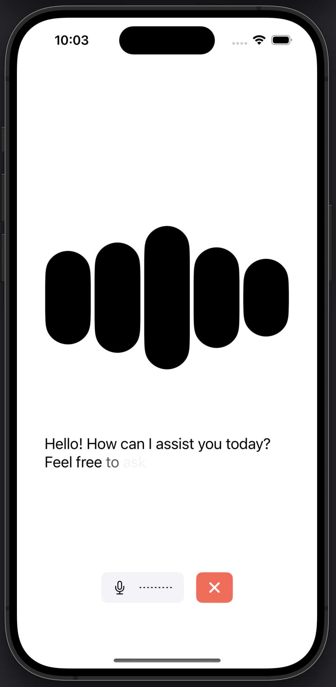

# Swift Voice Agent starter app

This starter app template for [LiveKit Agents](https://docs.livekit.io/agents/overview/) provides a simple voice interface using the [LiveKit Swift SDK](https://github.com/livekit/client-sdk-swift). It supports [voice](https://docs.livekit.io/agents/start/voice-ai), [transcriptions](https://docs.livekit.io/agents/build/text/), [live video input](https://docs.livekit.io/agents/build/vision/#video), and [virtual avatars](https://docs.livekit.io/agents/integrations/avatar/).

This template is compatible with iOS, iPadOS, macOS, and visionOS and is free for you to use or modify as you see fit.



## Getting started

First, you'll need a LiveKit agent to speak with. Try our starter agent for [Python](https://github.com/livekit-examples/agent-starter-python), [Node.js](https://github.com/livekit-examples/agent-starter-node), or [create your own from scratch](https://docs.livekit.io/agents/start/voice-ai/).

Second, you need a token server. The easiest way to set this up is with the [Sandbox for LiveKit Cloud](https://cloud.livekit.io/projects/p_/sandbox) and the [LiveKit CLI](https://docs.livekit.io/home/cli/cli-setup/).

First, create a new [Sandbox Token Server](https://cloud.livekit.io/projects/p_/sandbox/templates/token-server) for your LiveKit Cloud project.
Then, run the following command to automatically clone this template and connect it to LiveKit Cloud. This will create a new Xcode project in the current directory.

```bash
lk app create --template agent-starter-swift --sandbox <token_server_sandbox_id>
```

Then, build and run the app from Xcode by opening `VoiceAgent.xcodeproj`. You may need to adjust your app signing settings to run the app on your device.

> [!NOTE]
> To set up without the LiveKit CLI, clone the repository and then either create a `VoiceAgent/.env.xcconfig` with a `LIVEKIT_SANDBOX_ID` (if using a [Sandbox Token Server](https://cloud.livekit.io/projects/p_/sandbox/templates/token-server)), or modify `VoiceAgent/VoiceAgentApp.swift` to replace the `SandboxTokenSource` with a custom token source implementation.

## Feature overview

This starter app supports several features of the agents framework and is easily configurable to enable or disable them in code based on your needs as you adapt this template to your own use case.

### Text, video, and voice input

This app supports text, video, and/or voice input according to the needs of your agent. To update the features enabled in the app, edit `VoiceAgent/VoiceAgentApp.swift` and modify the `.environment()` modifiers to enable or disable features.

By default, all features (voice, video, and text input) are enabled. To disable a feature, change the value from `true` to `false`:

```swift
.environment(\.voiceEnabled, true)   // Enable voice input
.environment(\.videoEnabled, false)  // Disable video input
.environment(\.textEnabled, true)    // Enable text input
```

Available input types:
- `.voice`: Allows the user to speak to the agent using their microphone. **Requires microphone permissions.**
- `.text`: Allows the user to type to the agent. See [the docs](https://docs.livekit.io/agents/build/text/) for more details.
- `.video`: Allows the user to share their camera or screen to the agent. This requires a supported model like the Gemini Live API. See [the docs](https://docs.livekit.io/agents/build/vision/#video) for more details.

If you have trouble with screen sharing, refer to [the docs](https://docs.livekit.io/home/client/tracks/screenshare/) for more setup instructions.

### Session

The app is built on top of two main observable components from the [LiveKit Swift SDK](https://github.com/livekit/client-sdk-swift):
- `Session` object to connect to the LiveKit infrastructure, interact with the `Agent` and its local state, and send/receive text messages.
- `LocalMedia` object to manage the local media tracks (audio, video, screen sharing) and their lifecycle.

### Preconnect audio buffer

This app enables `preConnectAudio` by default to capture and buffer audio before the room connection completes. This allows the connection to appear "instant" from the user's perspective and makes your app more responsive. To disable this feature, set `preConnectAudio` to `false` in `SessionOptions` when creating the `Session`.

### Virtual avatar support

If your agent publishes a [virtual avatar](https://docs.livekit.io/agents/integrations/avatar/), this app will automatically render the avatar's camera feed in `AgentView` when available.

## Token generation in production

In production, you'll need to develop a solution to [generate tokens for your users](https://docs.livekit.io/home/server/generating-tokens/) that integrates with your authentication system. You should replace your `SandboxTokenSource` with an `EndpointTokenSource` or your own `TokenSourceFixed` or `TokenSourceConfigurable` implementation. Additionally, you can use the `.cached()` extension to cache valid tokens and avoid unnecessary token requests.

## Running on Simulator

To use this template with video (or screen sharing) input, you need to run the app on a physical device. Testing on the Simulator will still support voice and text modes, as well as virtual avatars.

## Submitting to the App Store

`LiveKitWebRTC.xcframework`, which is part of the LiveKit Swift SDK, does not contain dSYMs. Submitting the app to the App Store will result in the following warning:

```
The archive did not include a dSYM for the LiveKitWebRTC.framework with the UUIDs [...]. Ensure that the archive's dSYM folder includes a DWARF file for LiveKitWebRTC.framework with the expected UUIDs.
```

It will **not prevent** the app from being submitted to the App Store or passing the review process.

## Contributing

This template is open source and we welcome contributions! Please open a PR or issue through GitHub, and don't forget to join us in the [LiveKit Community Slack](https://livekit.io/join-slack)!

